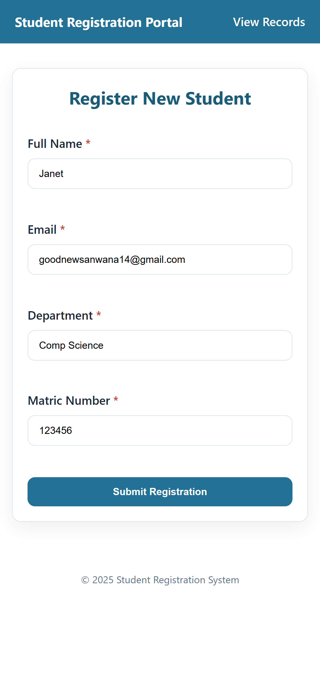

# Student Registration System

## Student Details
- **Name**: Gideon Ibanga Jonah
- **Matric Number**: 23/CSC/149
- **Course Code**: CSC 282
- **Assignment Title**: Student Registration System

## Project Overview
A simple PHP/MySQL web app that allows users to register new students, view existing records, and delete student entries. It uses PDO with prepared statements and creates the required table automatically on first run.

## Requirements
- **XAMPP** (Apache + MySQL/MariaDB + PHP 7.0+)
- **Web Browser** (JavaScript enabled)

## Quick Start (XAMPP on Windows)
1. Download/clone this repository into your XAMPP web root:
   - `C:\xampp\htdocs\student-registration`
2. Open **XAMPP Control Panel** and start:
   - **Apache**
   - **MySQL** (ensure it shows green/running)
3. Create a database named `student_db`:
   - phpMyAdmin: http://localhost/phpmyadmin → Databases → Create `student_db`
   - Or MySQL CLI:
     ```sql
     CREATE DATABASE IF NOT EXISTS student_db CHARACTER SET utf8mb4 COLLATE utf8mb4_unicode_ci;
     ```
4. Visit the app:
   - http://localhost/student-registration/
5. On first run, the app auto-creates the `student_records` table.

## Default Database Configuration
- **Host**: `localhost`
- **DB Name**: `student_db`
- **User**: `root`
- **Password**: (empty)

You can override via environment variables if needed:
- `DB_HOST`, `DB_NAME`, `DB_USER`, `DB_PASS`

## Troubleshooting
If you see this error:
> Database connection failed: SQLSTATE[HY000] [2002] No connection could be made because the target machine actively refused it

Please check:
1. **MySQL is running** in XAMPP (green indicator). Start/restart MySQL if needed.
2. **Port is open** (default 3306). If XAMPP shows a port conflict, change MySQL port and update your environment variables accordingly.
3. **Credentials are correct** for your MySQL installation (defaults to root with empty password on XAMPP). If you set a password for `root`, update it in `database.php` or via `DB_PASS`.
4. **PHP PDO MySQL extension** is enabled (XAMPP enables it by default). If disabled, enable `pdo_mysql` in `php.ini` and restart Apache.
5. If the host resolves oddly on your setup, try `127.0.0.1` as `DB_HOST`.

If you see "Unknown database 'student_db'":
- Create the database as shown above, then refresh the app.

## How to Use
1. Open `index.html` to register a new student.
2. Use `view.php` to see all registered students and delete entries.

## Screenshots
Attach or verify the screenshot here:



## Project Structure
- **database.php**: Database connection and table setup
- **process.php**: Form submission handler
- **delete.php**: Record deletion handler
- **view.php**: List of registered students
- **index.html**: Registration form
- **style.css**: App styles
- **images/**: Screenshots

---
Replace the placeholders in the Student Details section (Name, Matric Number, Course Code) before submitting/pushing to GitHub.
