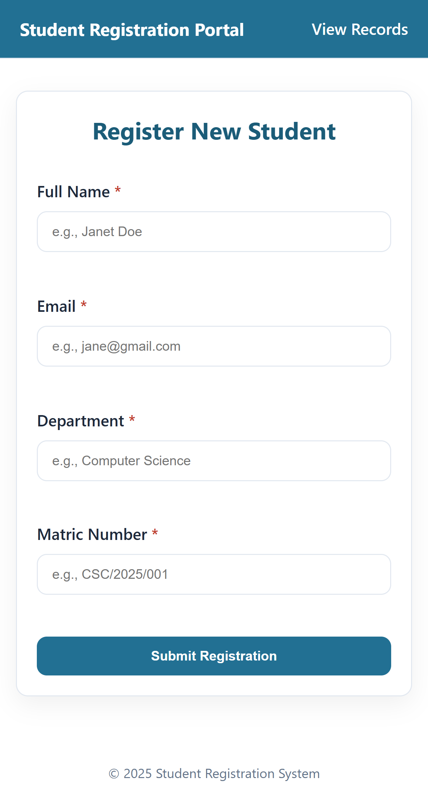

# Student Registration System

## Details
- **Name**: Gideon Ibanga Jonah
- **Matric Number**: 23/CSC/149
- **Course Code**: CSC 282
- **Assignment Title**: Student Registration System

## Project Overview
A simple PHP/MySQL web app that allows users to register new students, view existing records, and delete student entries.

## Requirements
- **XAMPP** (Apache + MySQL/MariaDB + PHP 7.0+)
- **Web Browser** (JavaScript enabled)

## Quick Start (XAMPP on Windows)
1. Clone the repository into your XAMPP web root as `student-registration`:
   - Open Command Prompt and run:
     ```bash
     git clone https://github.com/Gideon-Jonah/csc-23-CSC-149-assignment-repo.git C:\xampp\htdocs\student-registration
     ```
2. Open **XAMPP Control Panel** and start:
   - **Apache**
   - **MySQL** (ensure it shows green/running)
3. Import the sample database with records:
   - phpMyAdmin:
     1) Visit http://localhost/phpmyadmin
     2) Click Databases → create `student_db` (utf8mb4_unicode_ci)
     3) Click the `student_db` database → Import → Choose file → select `db/student_db.sql` → Go
   - Or MySQL CLI:
     ```bash
     mysql -u root -p -e "CREATE DATABASE IF NOT EXISTS student_db CHARACTER SET utf8mb4 COLLATE utf8mb4_unicode_ci;"
     mysql -u root -p student_db < db/student_db.sql
     ```
4. Visit the app:
   - http://localhost/student-registration/
5. Notes:
   - Default credentials in XAMPP: user `root`, empty password.
   - If you cloned into a different folder name, adjust the URL accordingly (e.g., `http://localhost/<folder-name>/`).

## Default Database Configuration
- **Host**: `localhost`
- **DB Name**: `student_db`
- **User**: `root`
- **Password**: (empty)

You can override via environment variables if needed:
- `DB_HOST`, `DB_NAME`, `DB_USER`, `DB_PASS`


## How to Use
1. Open `index.html` to register a new student.
2. Use `view.php` to see all registered students and delete entries.

## Screenshots
Here are snapshots of the web app's screens. You can find them in the `images` folder :




## Project Structure
- **database.php**: Database connection and table setup
- **process.php**: Form submission handler
- **delete.php**: Record deletion handler
- **view.php**: List of registered students
- **index.html**: Registration form
- **style.css**: App styles
- **images/**: Screenshots

---
## Troubleshooting
If you see this error:
> Database connection failed: SQLSTATE[HY000] [2002] No connection could be made because the target machine actively refused it

Please check:
1. **MySQL is running** in XAMPP (green indicator). Start/restart MySQL if needed.
2. **Port is open** (default 3306). If XAMPP shows a port conflict, change MySQL port and update your environment variables accordingly.
3. **Credentials are correct** for your MySQL installation (defaults to root with empty password on XAMPP). If you set a password for `root`, update it in `database.php` or via `DB_PASS`.
4. **PHP PDO MySQL extension** is enabled (XAMPP enables it by default). If disabled, enable `pdo_mysql` in `php.ini` and restart Apache.
5. If the host resolves oddly on your setup, try `127.0.0.1` as `DB_HOST`.

If you see "Unknown database 'student_db'":
- Create the database as shown above, then refresh the app.
